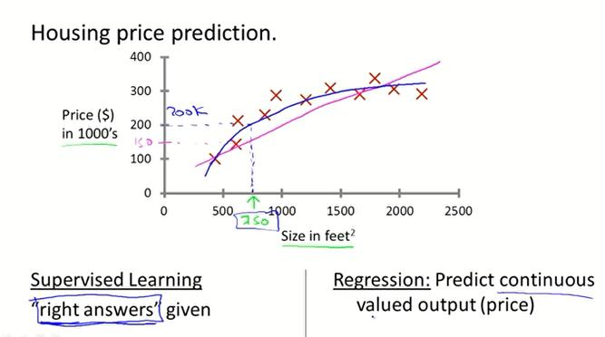
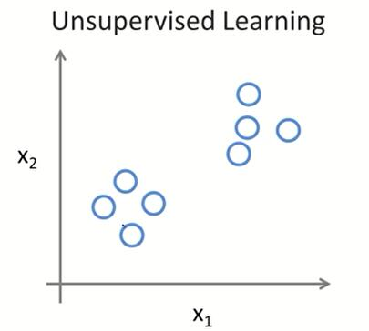

# Mechine Learning CS229 -1

## Chen Hao Open Course Notes.

### supervised learning

- supervised learning is based on right answers that was given

### unsupervised learning

- data that doesn't have any labels or that of all has the same label

### Linear Regression With One Variable

$$
% MathType!MTEF!2!1!+-
% feaagaart1ev2aaatCvAUfeBSjuyZL2yd9gzLbvyNv2CaerbuLwBLn
% hiov2DGi1BTfMBaeXatLxBI9gBaerbd9wDYLwzYbItLDharqqtubsr
% 4rNCHbWexLMBbXgBd9gzLbvyNv2CaeHbl7mZLdGeaGqiVu0Je9sqqr
% pepC0xbbL8F4rqqrFfpeea0xe9Lq-Jc9vqaqpepm0xbba9pwe9Q8fs
% 0-yqaqpepae9pg0FirpepeKkFr0xfr-xfr-xb9adbaqaaeGaciGaai
% aabeqaamaabaabauaakeaadaWfqaqaaiGac2gacaGGPbGaaiOBaiaa
% dMgacaWGTbGaamyAaiaadQhacaWGLbaaleaacqaH4oqCdaWgaaadba
% GaaGimaaqabaWccqaH4oqCdaWgaaadbaGaaGymaaqabaaaleqaaOWa
% aSaaaeaacaaIXaaabaGaaGOmaiaad2gaaaWaaabCaeaadaqadaqaai
% aadIgadaWgaaWcbaGaeqiUdehabeaakiaacIcacaWG4bWaaWbaaSqa
% beaacaGGOaGaamyAaiaacMcaaaGccaGGPaGaeyOeI0IaamyEamaaCa
% aaleqabaGaaiikaiaadMgacaGGPaaaaaGccaGLOaGaayzkaaWaaWba
% aSqabeaacaaIYaaaaaqaaiaadMgacqGH9aqpcaaIWaaabaGaamyBaa
% qdcqGHris5aaaa!630D!

\mathop {\min imize}\limits_{\theta _0 \theta _1 } \frac{1}{{2m}}\sum\limits_{i = 0}^m {\left( {h_\theta  (x^{(i)} ) - y^{(i)} } \right)^2 }
$$

cost function, squared error function:
$$
% MathType!MTEF!2!1!+-
% feaagaart1ev2aaatCvAUfeBSjuyZL2yd9gzLbvyNv2CaerbuLwBLn
% hiov2DGi1BTfMBaeXatLxBI9gBaerbd9wDYLwzYbItLDharqqtubsr
% 4rNCHbWexLMBbXgBd9gzLbvyNv2CaeHbl7mZLdGeaGqiVu0Je9sqqr
% pepC0xbbL8F4rqqrFfpeea0xe9Lq-Jc9vqaqpepm0xbba9pwe9Q8fs
% 0-yqaqpepae9pg0FirpepeKkFr0xfr-xfr-xb9adbaqaaeGaciGaai
% aabeqaamaabaabauaakeaacaWGkbGaaiikaiabeI7aXnaaBaaaleaa
% caaIXaaabeaakiaacYcacqaH4oqCdaWgaaWcbaGaaGOmaaqabaGcca
% GGPaGaeyypa0ZaaSaaaeaacaaIXaaabaGaaGOmaiaad2gaaaWaaabC
% aeaadaqadaqaaiaadIgadaWgaaWcbaGaeqiUdehabeaakiaacIcaca
% WG4bWaaWbaaSqabeaacaGGOaGaamyAaiaacMcaaaGccaGGPaGaeyOe
% I0IaamyEamaaCaaaleqabaGaaiikaiaadMgacaGGPaaaaaGccaGLOa
% GaayzkaaWaaWbaaSqabeaacaaIYaaaaaqaaiaadMgacqGH9aqpcaaI
% WaaabaGaamyBaaqdcqGHris5aaaa!5F1D!
J(\theta _1 ,\theta _2 ) = \frac{1}{{2m}}\sum\limits_{i = 0}^m {\left( {h_\theta  (x^{(i)} ) - y^{(i)} } \right)^2 }
$$

simple example with only one example

$$
% MathType!MTEF!2!1!+-
% feaagaart1ev2aaatCvAUfeBSjuyZL2yd9gzLbvyNv2CaerbuLwBLn
% hiov2DGi1BTfMBaeXatLxBI9gBaerbd9wDYLwzYbItLDharqqtubsr
% 4rNCHbWexLMBbXgBd9gzLbvyNv2CaeHbl7mZLdGeaGqiVu0Je9sqqr
% pepC0xbbL8F4rqqrFfpeea0xe9Lq-Jc9vqaqpepm0xbba9pwe9Q8fs
% 0-yqaqpepae9pg0FirpepeKkFr0xfr-xfr-xb9adbaqaaeGaciGaai
% aabeqaamaabaabauaakeaacqaH4oqCdaWgaaWcbaGaamOsaaqabaGc
% caGG6aGaeyypa0JaeqiUde3aaSbaaSqaaiaadQeaaeqaaOGaeyOeI0
% IaeqySde2aaSaaaeaacqGHciITaeaacqGHciITcqaH4oqCdaWgaaWc
% baGaamOsaaqabaaaaOGaamOsaiaacIcacqaH4oqCdaWgaaWcbaGaaG
% imaaqabaGccaGGSaGaeqiUde3aaSbaaSqaaiaaigdaaeqaaOGaaiyk
% aaaa!569A!

\theta _J : = \theta _J  - \alpha \frac{\partial }{{\partial \theta _J }}J(\theta _0 ,\theta _1 )
$$

