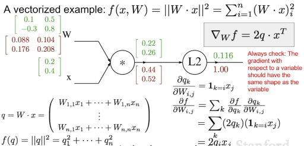

CS231-4 Introduction to Neural Network

#### 1. Computational graphs


#### 2.Backpropagation, example


##### local gradient & gradient


##### example


e^(-1) * -0.53 = -0.20


we can combine some function.



```python
import numpy as np
from numpy.random import randn

N, D_in, H, D_out = 64, 1000, 100, 10
x, y = randn(N, D_in), randn 
w1, w2 = randn(D_in, H), randn(H, D_out) #random weight

for t in range(2000):
    h = 1 / (1 + np.exp(-x.dot(w1)))
    y_pred = h.dot(w2)
    loss = np.square(y_pred-y).sum()
    print(t, loss)

    grad_y_pred = 2.0 * (y_pred-y)
    grad_w2 = h.T.dot(grad_y_pred)
    grad_h = grad_y_pred.dot(w2.T)
    grad_w1 = x.T.dot(grad_h * h * (1 - h))

    w1 -= 1e-4 * grad_w1
    w2 -= 1e-4 * grad_w2
```

