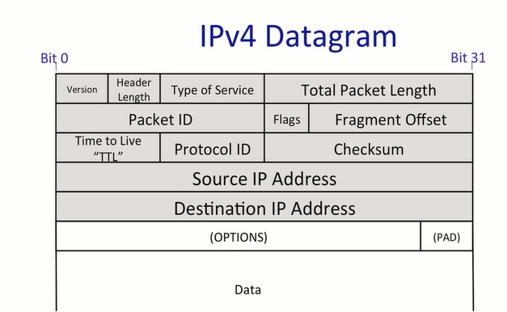

# CS114-1 An Introduction to Computer Networks

outline:

1. The structure of the Internet: The 4 layer model
2. The Internet protocol(IP): What it is
3. Basic architectural ideas and principles
   - Packet switching
   - Layering
   - Encapsulation

## The 4 Layer Internet Model

- link layer

  Delivers data over a single link between an end host and router, or between routers.

- network

  Delivers datagrams end-to-end. Best-effort delivery - no guarantees. Must use the Internet Protocol(IP)

- transport

  Guarantees correct , in-order delivery of data end-to-end. Controls congestion.

- application

  Bi-directional reliable byte stream between two applications, using application-specific semantic.(e.g. http, bit-torrent)

The Network Layer almost can only choose IP protocol.

## The Internet Protocol(IP)

1.  IP datagrams consist of a header and some data
2. When the transport layer has data to send, it hands a Transport Segment to the Network layer below.
3. The network layer puts the transport segement inside a new IP datagram.
4. IP's job is to deliver the datagram to the other end.

1. Tried to prevent packets looping forever.
2. Will fragment packets if they are too long.
3. Uses a header checksum to reduce chances of delivering datagram to wrong destination.
4. Allows for new versions of IP.
5. Allows for new options to be added to header.

### summary

We use IP every time we send and receive datagrams.

IP provides a deliberately simple service:

- Datagrams
- best effort
- unreliable
- connectionless

##  A Day in the Life of a Packet

3-way handshake

SYN, SYS/ACK, ACK

Use winshark to see the 3-way handshake.

## Packet switching

**Packet:** A self-contained unit of data that carries information necessary for it to reach its destination.

**Packet switching:** Independently for each arriving packet, pick its outgoing link. If the link is free, send it. Else hold the packet for later.

##### Reasons for layering

- Modularity
- Well defined service
- Reuse
- Separation of concerns
- Continuous improvement
- Peer-to-peer communications

## Principle: Encapsulation

Example: Virtual Private Network(VPN):

- HTTP (web) application payload in
- a Tcp transport segment in
- an IP network packet in
- a secured TLS presentation message in 
- a TCP transport segment in 
- an IP network packet in 
- an Ethernet link frame

## Memory, Byte Order, and Packet Format

Big endian Makes most sense to human reader

## IPv4 Address

- An IPv4 address identifies a device on the internet
- 32 bit long
- Netmask: apply this mask, if it matches, in the same network

Longest Prefix Match

- Algorithm IP routers use to chose matching entry from forwarding table
- Forwarding table is a set of CIDR entries
  - An address might match muliple entries
  - E.g., 171.33.0.1 matches both entries on right
- Algorithm: use forwarding entry with the longest matching prefix
  - Longest prefix match will chose link 5 for 171.33.0.1

## Address Resolution Protocol

- Generates mappings between layer 2 and layer 3 address
  - Nodes cache mappings cache entries expire
- Simple request-reply protocol
  - "Who has network address X?"
  - "I have network address X"
- Request sent to link layer broadcast address
- Reply sent to requesting address(not broadcast)
- Packet format includes redundant data
  - Request has sufficient information to generate a mapping
  - Makes debugging much simper
- No "sharing" of state: bad state will die eventually

- IP packet from A to B, encapsulated inside a link layer frame from A to left gatewar interface.