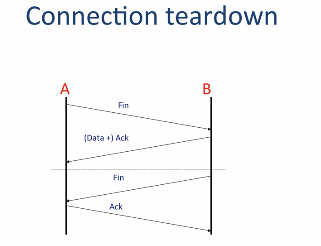
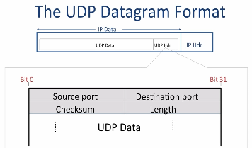

# CS114-2 公开课学习笔记：Transport

outline:

1. Three Transport Layers: TCP, UDP, ICMP
2. How TCP works: Connections and Retransmissions
3. How UDP works
4. How ICMP works
5. The End to End Principle

goal:

-  have a good understanding of the three different Transport Layers
- understand different retransmission strategies and why TCP uses a "Sliding Window"
- know why TCP uses connections, how they are established and the state machine that maintain them.
- be able to explain the End to End Principle

## TCP service model

- The TCP layer at Host A can close the connection by sending a FIN message
- Host B acknowledges that no longer has data to send and stops looking for new data from A. This closes the data stream from A to B. But B might still have new data to send to A and is not ready to close down the channel from B to A. So the message from B to A carrying the ACK message can also carry new data.
- B finishes sending data to A, and send its own FIN to tell A they can close the connection.
- A send ACK to a full close.

### The TCP Service Model

- Stream of bytes: Reliable byte delivery service

- Reliable delivery: 
  1. Acknowledgments indicate correct delivery.
  2. Checksums detect corrupted data.
  3. Sequence numbers detect missing data.
  4. Flow-control prevents overrunning receiver.
- In-sequence: Data delivered to application in sequence transmitted
- Congestion Control: Control network congestion.

### The UDP Sevice Model

- Connectionless: No connection established
- Datagram Service: Packets may show up in any order.
- Self contained datagram
- Unreliable delivery:
  1. No acknowledgments.
  2. No mechanism to detect missing or mis-sequenced datagrams.
  3. No flow control.

#### The Internet Control Message Protocol(ICMP) Service Model

Internet Control Message Protocol(ICMP)

- Communicates network layer information between end hosts and routers
- Reports error conditions
- Helps us diagnose problems

## Finite State Machine

