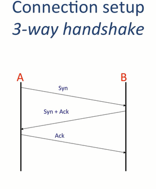

# CS114-2 公开课学习笔记：Transport

outline:

1. Three Transport Layers: TCP, UDP, ICMP
2. How TCP works: Connections and Retransmissions
3. How UDP works
4. How ICMP works
5. The End to End Principle

goal:

-  have a good understanding of the three different Transport Layers
- understand different retransmission strategies and why TCP uses a "Sliding Window"
- know why TCP uses connections, how they are established and the state machine that maintain them.
- be able to explain the End to End Principle

## TCP service model

- The TCP layer at Host A can close the connection by sending a FIN message
- Host B acknowledges that no longer has data to send and stops looking for new data from A. This closes the data stream from A to B. But B might still have new data to send to A and is not ready to close down the channel from B to A. So the message from B to A carrying the ACK message can also carry new data.
- B finishes sending data to A, and send its own FIN to tell A they can close the connection.
- A send ACK to a full close.

## The TCP Service Model

- Stream of bytes: Reliable byte delivery service

- Reliable delivery: 
  1. Acknowledgments indicate correct delivery.
  2. Checksums detect corrupted data.
  3. Sequence numbers detect missing data.
  4. Flow-control prevents overrunning receiver.
- In-sequence: Data delivered to application in sequence transmitted
- Congestion Control: Control network congestion.

## The UDP Sevice Model

- Connectionless: No connection established
- Datagram Service: Packets may show up in any order.
- Self contained datagram
- Unreliable delivery:
  1. No acknowledgments.
  2. No mechanism to detect missing or mis-sequenced datagrams.
  3. No flow control.

## The Internet Control Message Protocol(ICMP) Service Model

Internet Control Message Protocol(ICMP)

- Communicates network layer information between end hosts and routers
- Reports error conditions
- Helps us diagnose problems

## End to End principle

Strong End to End

The network's job is to transmit datagrams as efficiently and flexibly as possible. Everything else should be done at the **fringes**. -[RFC 1958]

## Error Detection: 3 schemes

- #### Checksum adds up values in packet(IP, TCP)

  - IP, UDP and TCP use one's complement checksum algorithm
  - Set checksum field to 0, sum all 16-bit words in packet
  - add any carry bits back in: 0x8000 + 0x8000 = 0x0001
  - Flip bits (0xc379 becomes 0x3c86), unless 0xffff, then checksum is 0xffff

- #### CRC Cyclic redundancy code computes remainder of a polynomial(Ethernet)

  - distill n bits of data into c bits, c<<n
  - detect any message with a odd number of bit errors
  - detect any message with 2 bits in error
  - detect any message with a single burst of errors < c bits long
  - Link layer typically use CRCs

  

- #### MAC

## Finite State Machine

Start a TCP connection with a three way handshake -- SYN, SYN/ACK, ACK.

- The client or active opener, sends a SYN, synchronization, message to a program listening for connection requests.
- When it receives a SYN, it responds with a SYN/ACK, synchronizing and acknowledging the original synchronization. 
- The active opener, on receiving the SYN/ACK, responds with an acknowledgement. 
- A passive opener is a server. It listens for requests for connection from active openers, clients.

## Flow Control

- Don't send more packets than receiver can process
- Receiver gives sender feedback
- Two basic approaches
  - Stop and wait
    - at most one packet in flight at any time
    - Sender sends one packet
    - Receiver sends acknowledgment packet when it receives data
    - On receiving acknowledgment, sender sends new data
    - On timeout, sender resends current data
  - Sliding window
    - Generalization of stop-and-wait: allow multiple un-acked segments
    - Bound on number of un-acked segments, called window
    - Can keep pipe full
    - 